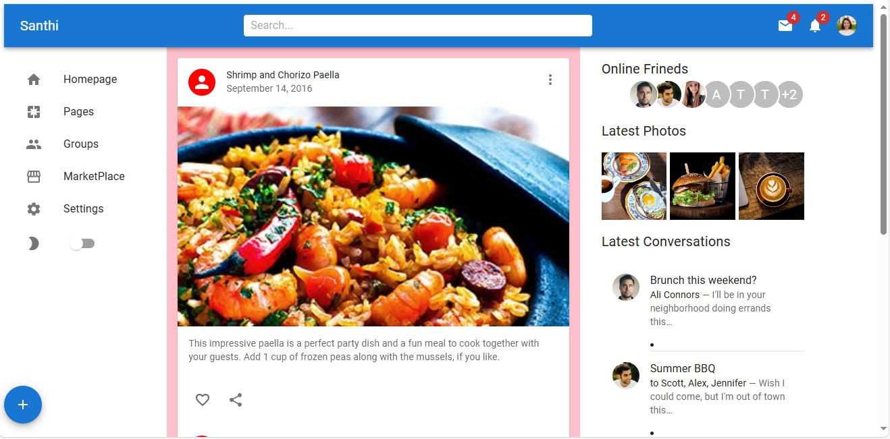

# About

This project is a single-page application designed using Material-UI (MUI), a popular React component library. The page showcases a social platform layout with features such as a user feed, navigation menu, online friends list, and latest conversations.

# Technologies Used

---> React.js: For building the user interface.
---> Material-UI (MUI): For designing the page layout and components.


# Start the development server
```
npm run dev

```
# Image


